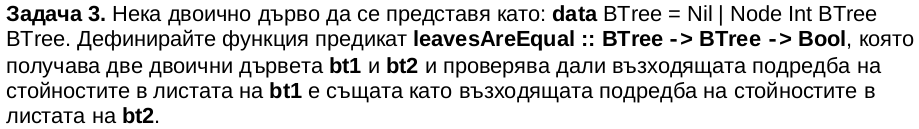
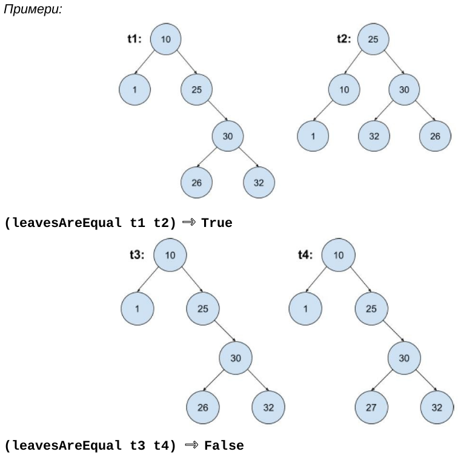

# Task 1
Define a function that checks whether a word is present in a binary tree made up of characters.

Test cases:

    --print $ containsWord t1 "" -- error
    print $ containsWord t1 "acd" == True
    print $ containsWord t1 "cd" == True
    print $ containsWord t1 "af" == False
    print $ containsWord t1 "ac" == False
    print $ containsWord t1 "acdh" == False
    print $ containsWord t2 "ab" == True
    print $ containsWord t2 "ad" == False
    print $ containsWord t3 "bdh" == True
    print $ containsWord t3 "bdi" == True
    print $ containsWord t3 "ac" == False

Trees:

    t1:    a
          / \
         c   b
        / \   \
       f   d   e

    t1 :: BTree Char
    t1 = Node 'a' (Node 'c' (Node 'f' Nil Nil) (Node 'd' Nil Nil)) (Node 'b' Nil (Node 'e' Nil Nil))

    t2 :: BTree Char
    t2 = Node 'a' (Node 'c' (Node 'd' Nil Nil) Nil) (Node 'b' Nil Nil)

    t3 :: BTree Char
    t3 = Node 'a' (Node 'b' (Node 'd' (Node 'h' Nil Nil) (Node 'i' Nil Nil)) (Node 'e' Nil Nil)) (Node 'c' (Node 'f' Nil Nil) (Node 'g' Nil Nil)) 

# Task 2
Define a function that returns all possible word combinations from a binary tree made up of characters.

Trees:

    t1:    a
          / \
         c   b
        / \   \
       f   d   e

    t1 :: BTree Char
    t1 = Node 'a' (Node 'c' (Node 'f' Nil Nil) (Node 'd' Nil Nil)) (Node 'b' Nil (Node 'e' Nil Nil))

    t2 :: BTree Char
    t2 = Node 'a' (Node 'c' (Node 'd' Nil Nil) Nil) (Node 'b' Nil Nil)

    t3 :: BTree Char
    t3 = Node 'a' (Node 'b' (Node 'd' (Node 'h' Nil Nil) (Node 'i' Nil Nil)) (Node 'e' Nil Nil)) (Node 'c' (Node 'f' Nil Nil) (Node 'g' Nil Nil)) 

Test case:

    print $ genWords t1 == ["acf","acd","abe","cf","cd","f","d","be","e"]
    print $ genWords t2 == ["acd","ab","cd","d","b"]
    print $ genWords t3 == ["abdh","abdi","abe","acf","acg","bdh","bdi","be","dh","di","h","i","e","cf","cg","f","g"]

# For home
# Task 1
Define a new data type representing a binary tree of whole numbers. By using it, firstTree and secondTree define a function that returns the sum of the nodes with values between L and R (inclusive).

firstTree:

secondTree:

Test cases:

    print $ rangedSum firstTree 100 50 == 0 -- (L = 100, R = 50)
    print $ rangedSum firstTree 7 15 == 32 -- (L = 7, R = 15)
    print $ rangedSum firstTree 15 7 == 32 -- (L = 15, R = 7)
    print $ rangedSum secondTree 6 10 == 23 -- (L = 6, R = 10)
    print $ rangedSum secondTree 10 6 == 23 -- (L = 10, R = 6)

# Task 2
Define a function that modifies a BST so that every node *n* has a new value equal to the sum of the values of the original tree that are greater than or equal to the value of *n*.

Test case:

    print $ convert tree == (Node 30 (Node 36 (Node 36 Nil Nil) (Node 35 Nil (Node 33 Nil Nil))) (Node 21 (Node 26 Nil Nil) (Node 15 Nil (Node 8 Nil Nil))))

# Task 3
A binary tree is a *cone* if at every level the sum of the nodes is greater than than the sum at the previous level.

Define a function that:

 - returns the sum of the nodes at level *k*;
 - returns whether a tree is a cone.

Use the following representation of a binary tree:

    data BTree = Nil | BTree Int BTree BTree

*numberBTree*:

Test cases:

    print $ levelSum numberBTree 1 == 11 -- (5 + 6)
    print $ cone numberBTree == True

# Task 4

